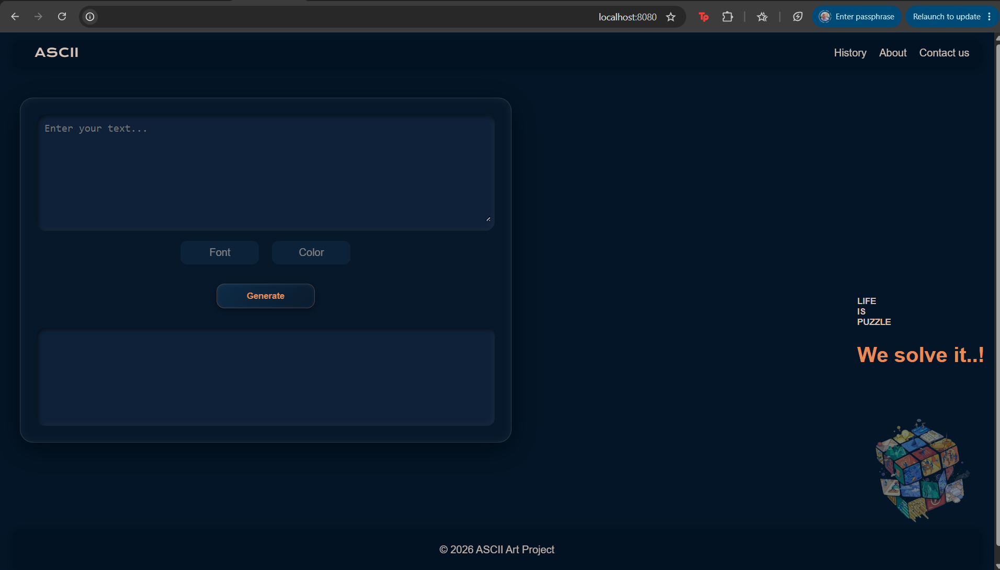

# 🎨 ASCII Art Web Generator

<p align="center">

# ✨ Turn Text Into Beautiful ASCII Art ✨

A modern **Go Web Application** that transforms plain text into stunning **ASCII Art** using multiple fonts, customizable colors, and a clean responsive interface.



</p>

---

## 🌟 Features

✨ Convert any text into ASCII Art instantly

🎨 Multiple banner fonts

* Standard
* Shadow
* Thinkertoy

🌈 Color customization

📝 Multi-line text support

⚡ Fast Go backend

📱 Responsive Design

📚 Additional Pages

* 🏠 Home
* 📖 History
* 💡 About
* 📩 Contact

🛡️ Built-in Error Handling

---


# 🛠️ Built With

<p>

🟦 **Go (Golang)**

🌐 **HTML5**

🎨 **CSS3**

📄 **Go Templates**

⚙️ **net/http**

</p>

---

# 📂 Project Structure

```text
ascii-art-web
│
├── ascii
│   ├── fonts
│   │   ├── standard.txt
│   │   ├── shadow.txt
│   │   └── thinkertoy.txt
│   └── renderer.go
│
├── handler
│   └── handler.go
│
├── templates
│   ├── layout.html
│   ├── index.html
│   ├── about.html
│   ├── history.html
│   └── contact.html
│
├── static
│   ├── style.css
│   └── image.png
│
├── main.go
└── README.md
```

---

# ⚙️ How It Works

```text
          🌍 Browser
               │
               ▼
        HTTP Request
               │
               ▼
         Go HTTP Server
               │
               ▼
          HTTP Router
               │
      ┌────────┼────────┐
      ▼        ▼        ▼
    Home    ASCII     About
      │        │
      │        ▼
      │   Read Form
      │        │
      │        ▼
      │  Load Banner
      │        │
      │        ▼
      │ Generate ASCII
      │        │
      └────────▼─────────► Render Template ► Browser
```

---

# 🌐 Available Routes

| Route       | Method | Description           |
| :---------- | :----: | --------------------- |
| `/`         |   GET  | 🏠 Home Page          |
| `/ascii-art`|  POST  | 🎨 Generate ASCII Art |
| `/about`    |   GET  | 💡 About Project      |
| `/history`  |   GET  | 📖 ASCII History      |
| `/contact`  |   GET  | 📩 Contact Page       |
| `/static/*` |   GET  | 📁 Static Files       |

---

# 🎯 Supported Fonts

| Font       | Preview |
| ---------- | ------- |
| Standard   | ⭐⭐⭐⭐⭐   |
| Shadow     | ⭐⭐⭐⭐⭐   |
| Thinkertoy | ⭐⭐⭐⭐⭐   |

---

# ❗ Error Handling

✅ Invalid HTTP Method

✅ Invalid Route

✅ Missing Banner File

✅ Invalid Banner

✅ Unsupported Characters

✅ Template Rendering Errors

---

# 🚀 Getting Started

### 1️⃣ Clone the repository

```bash
git clone https://01.nextera.education/git/momahmoud/ascii-art-web
```

### 2️⃣ Navigate to the project

```bash
cd ascii-art-web
```

### 3️⃣ Run the application

```bash
go run .
```

### 4️⃣ Open your browser

```
http://localhost:8080
```

---

# 💻 Example

Input

```text
Hello
```

↓

Output

```text
 _   _      _ _
| | | | ___| | | ___
| |_| |/ _ \ | |/ _ \
|  _  |  __/ | | (_) |
|_| |_|\___|_|_|\___/
```

---

# 🚧 Future Improvements

* 📋 Copy ASCII with one click
* 📥 Download as TXT
* 🌙 Dark / Light Theme
* 🔥 More Fonts
* ⚡ Live Preview
* 🕘 Generation History

---


### ❤️ Developed by

**Enas Essam**

**Mostafa Mahmoud**

---


<p align="center">

### ✨ Made with Go ❤️ and lots of Coffee ☕

</p>
